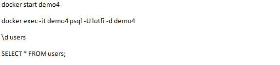

# projectF

#hey

Course: Distributed Software Systems
Project Type: Academic Distributed System Project

1. Project Overview
   This project aims to design and implement a Distributed Task Management System based on a
   microservices architecture. The system allows an Administrator to assign tasks to users or groups,
   while end users can track and update task statuses using web and mobile applications. The main
   goal is to demonstrate core concepts of distributed systems through a real-world use case.
2. Client Applications
   The system includes two frontend applications:- An Angular Web Dashboard designed for administrators to manage users,
   groups, and tasks.- An Ionic Mobile Application developed for end users, enabling cross-platform access on Android
   and iOS devices. Both applications communicate with the backend exclusively through an API
   Gateway using RESTful APIs secured with JWT authentication.
3. System Architecture
   The system follows a microservices-based distributed architecture. All incoming requests from
   frontend clients pass through an API Gateway, which routes them to the appropriate backend
   service.
   Backend Services:- API Gateway: Single entry point responsible for request routing and security enforcement.-
   Authentication Service: Handles user authentication and authorization using JWT tokens.- User Service: Manages users
   and groups within the system.- Task Service: Responsible for task creation, assignment, and status tracking.-
   Notification Service: Sends asynchronous notifications when task-related events occur.
4. Distributed Systems Concepts
   This project applies several fundamental distributed systems concepts:- Microservices Architecture- Asynchronous,
   Event-Driven Communication- Service Isolation and Fault Tolerance- Scalability and Load Balancing- Eventual
   Consistency
5. Technology Stack
   Frontend: Angular (Admin Dashboard), Ionic (Mobile Application)
   Backend: Java, Spring Boot, Spring Cloud
   Database: PostgreSQL (Database per Service)
   Messaging: Kafka or RabbitMQ
   Containerization: Docker and Docker Compose
6. Conclusion
   This project demonstrates a complete distributed software system combining web and mobile
   clients with a scalable microservices backend. It effectively showcases the fundamental principles
   of distributed systems required for academic evaluation
1. System Architecture Diagram (Distributed System)
   +---------------------+
   | USER APP |
   |  (Web / Mobile)     |
   +----------+----------+
   |
   | HTTP / REST
   v
   +-----------------------------+
   | SPRING BOOT API |
   | Controllers + Services |
   +-----------------------------+
   | | |
   | | |
   | | |
   PostgreSQL | RabbitMQ | SMTP Email
   +----------------+ | +------------+ | +----------------+
   | Database |<--+-->| Producer |--+->| Gmail SMTP |
   | Users/Tasks | | Consumer | | Notifications |
   | Notifications | +------------+ +----------------+
   | Chat Messages |
   +----------------+

                   +---------------------+
                   |      ADMIN APP      |
                   |  (Dashboard Panel)  |
                   +---------------------+

Use Case Diagram
+--------------------+
| SYSTEM |
+--------------------+

      User                                   Admin
       |                                        |
       |                                        |
       |---- Register --------------------------|
       |---- Login -----------------------------|
       |---- Send Message to Admin -------------|
       |---- View Inbox ------------------------|
       |---- View Sent Messages ----------------|
       |---- View Tasks ------------------------|
       |---- Complete Task ---------------------|
       |---- View Notifications ----------------|
       |---- Mark Notification as Read ---------|

                                                |---- Login
                                                |---- Approve User
                                                |---- Create User
                                                |---- Update User
                                                |---- Delete User
                                                |---- Assign Task
                                                |---- Send Notification
                                                |---- Send Message to User
                                                |---- View All Users
                                                |---- View All Tasks
                                                |---- View Chat Inbox
                                                |---- View Chat Sent

